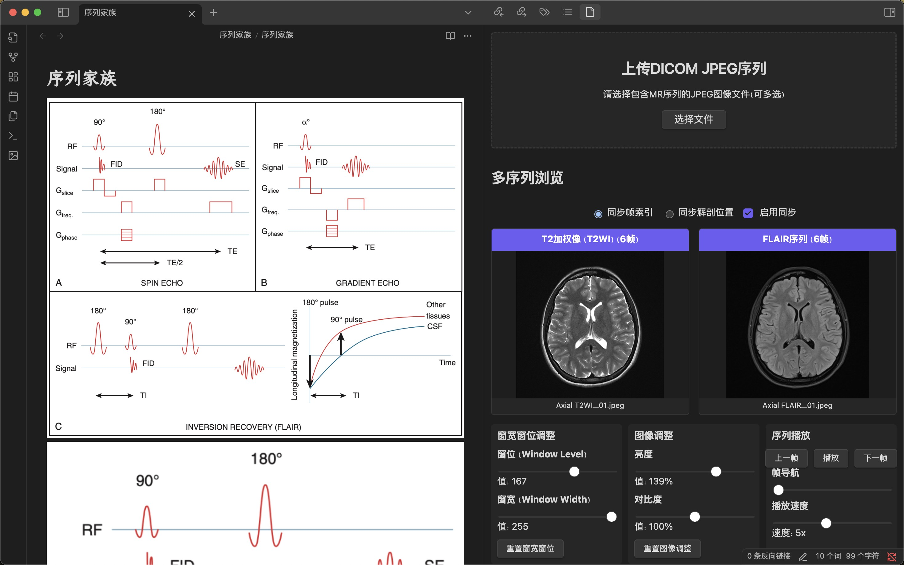

# Obsidian MR Viewer Plugin
## 一款便于在OB中边记笔记边看图像的MR图像浏览器

开发中……

已实现的功能：
- 根据文件名自动识别常见序列并加载到图像浏览器
- 多序列同步显示
- 调整窗宽窗位
- 调整亮度、对比度
- 同步帧索引
- 流畅的滚轮翻页图像浏览性能优化
- 注：目前只支持导入JPEG图像（未来可能会考虑支持DICOM图像导入），图像文件名中需包含序列名和层序号（如T1WI-01、SWI-02、DWI-03……），插件会自动识别多个序列并进行分组

使用方法（开发测试使用）
- 将文件下载到OB plugins文件夹
- 终端运行`cd ob-mr-viewer`
- 安装依赖`npm install`
- 运行开发服务器`npm run dev`
- 在OB中使用`MR-Viewer`插件
